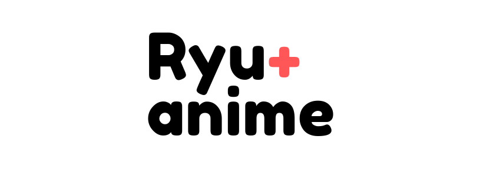

[](#contributors)

<h1 align="center">Welcome to ryuanime 👋</h1>
<p>
  
  
  
  <a href="https://github.com/ChrisMichaelPerezSantiago/ryuanime#readme">
    
  </a>
  <a href="https://github.com/ChrisMichaelPerezSantiago/ryuanime/graphs/commit-activity">
    
  </a>
  <a href="https://github.com/ChrisMichaelPerezSantiago/ryuanime/blob/master/LICENSE">
    
  </a>
  <a href="https://twitter.com/Chris5855M">
    
  </a>
</p>

*A free anime streaming , using the jkanime content by scraping the jkanime website.*

## How will the project work?

This project will be completely a desktop version. For this `Electron` will be used, a framework developed by GitHub which allows us to develop `multiplatform systems` based on `web technologies`, and maybe it will have its web version, but everything will depend on the development flow.

## Where does the content come from?
The content comes from the page of `jkanime.` For this, `scraping` has been done on the page of jkanime.

### 👷🚧In construction 
*I must say that as the days go by the project can undergo great changes. That is why I ask for your patience, to which the documentation is updated.*

- [x] Frontend - *in process*	
- [x] Backend - *in process*
- [x] Scraping jkanime web page - *in process* 
- [x] Good Documentation - *in process*
- [ ] Tests - *SOON!*
- [ ] Deployment -  *SOON!*

## Branches
- [x] master branch - *in use*
## Prerequisites

- `npm` &gt;=5.5.0
- `node` &gt;=9.3.0

## Install

```sh
npm install
```

## Usage

```sh
npm run dev
```

## Packages
*These are the packages that I have taken more advantage for the project.*
- `cheerio` Fast, flexible & lean implementation of core jQuery designed specifically for the server.
- `puppeteer` Puppeteer is a Node library which provides a high-level API to control Chrome or Chromium over the DevTools Protocol. Puppeteer runs headless by default, but can be configured to run full (non-headless) Chrome or Chromium.
- `express` Fast, unopinionated, minimalist web framework for node.
- `compose-middleware` Compose an array of middleware into a single function for use in Express, Connect, router, etc.

## Request & Response Examples
*It may be that changes are made in the future in the `parameterization structure.`*

### GET /anime/[id]/[chapter]
| id          | chapter         |
| ----------- | --------------- |
| anime title | episode number  |

```json
// 20190619164418
// http://localhost:3000/api/v1/anime/tokyo-ghoul/1
{
  "video": [
    "https://storage.googleapis.com/markesito.appspot.com/tokgho/01.mp4"
  ]
}
```

### GET /search/[title] 
- *For now only returns the titles of the first page of jkanime `10 title per pages`*

| title       |
| ----------- |
| anime title |

```json
// 20190619165728
// http://localhost:3000/api/v1/search/tokyo

{
  "animes": [
    [
      {
        "title": "Tokyo Ghoul",
        "id": "tokyo-ghoul",
        "poster": "https://cdn.jkanime.net/assets/images/animes/image/tokyo-ghoul.jpg",
        "type": "Serie / 12 Eps",
        "synopsis": "En Tokyo ocurren asesinatos misteriosos cometidos por Ghouls, seres desconocidos que comen carne humana, un día Kaneki Ken un joven de 18 años que cursa la Universidad conoce a una chica en un restaurante y la invita a salir, pero luego se da cuenta que ella es un Ghoul y sufre un ataque de parte…"
      }
    ],
    .......
  ]
}
```

### GET /letter/[a-z]/[page]
- *Returns a list of `20 titles` per N pages*

| a-z         | page            |
| ----------- | --------------- |
| list of animes that the title begin with a letter [a-z]| actual page|

```json
// 20190619171717
// http://localhost:3000/api/v1/letter/a/1

{
  "animes": [
    [
      {
        "title": "Abarenbou Kishi!! Matsutarou",
        "id": "abarenbou-kishi-matsutarou",
        "poster": "https://cdn.jkanime.net/assets/images/animes/image/abarenbou-kishi-matsutarou.jpg",
        "type": "Serie / 23 Eps",
        "synopsis": "Matsutarou Sakaguchi es un hombre matón gigante con fuerza mucho más allá de la gente común. Él nunca pronunció palabras como \"trabajar duro\", \"luchar\" y \"sueño\" como el típico protagonista del manga shonen. Sin embargo, él es más fuerte que nadie y sin igual en la lucha de sumo. Su mayor…"
      }
    ],
    .......
  ]
}
```

### GET /latest
- *Returns a list of `40 latest titles`*

| latest         | page            |
| ----------- | --------------- |
| list of last titles added.| one page |

```json
{
  "animes": [
    [
      {
        "title": "Re:Zero kara Hajimeru Isekai Seikatsu: Memory Snow",
        "id": "rezero-kara-hajimeru-isekai-seikatsu-memory-snow",
        "poster": "https://cdn.jkanime.net/assets/images/animes/image/rezero-kara-hajimeru-isekai-seikatsu-memory-snow.jpg",
        "type": "unknown",
        "synopsis": "unknown"
      }
    ], 
    .......
  ]
}
```

## Middleware
*As the project grows, more functions will be implemented soon.*

| Function    | Info           |
| ----------- | --------------- |
| requestLoggerMiddleware | <li>req.method</li><li>req.originalUrl</li><li>req.statusCode</li> |
| errorHandler            | <li>err.message</li><li>err.stack</li> |
| notFound                | <li>Error - req.originalUrl</li>


## 🚀 Deployment

*`Now.sh` is a Realtime Global Deployments platform. It provides an easy way to deploy websites, applications and services built and powered with JavaScript (Node.js) or Docker*

- **Deployment of the node/express API** - Deployment of the API for official use. So we do not have to use localhost to handle the endpoints in production.

- **Deployment of the ryuanime web site** - Deployment for official use.

## Author

👤 **Chris Michael**

* Twitter: [@Chris5855M](https://twitter.com/Chris5855M)
* Github: [@ChrisMichaelPerezSantiago](https://github.com/ChrisMichaelPerezSantiago)

## ❤️ Contributors
 If you are interested in contributing to this project, you can contact me at my email, and I will gladly respond to the messages. For more see the [CODE OF CONDUCT](https://github.com/ChrisMichaelPerezSantiago/ryuanime/blob/master/CODE_OF_CONDUCT.md)
 
## 💩 Issue Template
If you have a problem, you can visit the [BUG REPORT](https://github.com/ChrisMichaelPerezSantiago/ryuanime/blob/master/.github/ISSUE_TEMPLATE/bug_report.md) or [FEATURE REQUEST](https://github.com/ChrisMichaelPerezSantiago/ryuanime/blob/master/.github/ISSUE_TEMPLATE/feature_request.md) template for more details.

## Show your support

Give a ⭐️ if this project helped you!

## 📝 License

Copyright © 2019 [Chris Michael](https://github.com/ChrisMichaelPerezSantiago).<br />
This project is [MIT](https://github.com/ChrisMichaelPerezSantiago/ryuanime/blob/master/LICENSE) licensed.

***
_This README was generated with ❤️ by [readme-md-generator](https://github.com/kefranabg/readme-md-generator)_

## Contributors ✨

Thanks goes to these wonderful people ([emoji key](https://allcontributors.org/docs/en/emoji-key)):

<!-- ALL-CONTRIBUTORS-LIST:START - Do not remove or modify this section -->
<!-- prettier-ignore -->
<table>
  <tr>
    <td align="center"><a href="https://www.linkedin.com/in/chrisperezsantiago/"><br /><sub><b>Chris Michael</b></sub></a><br /><a href="#question-ChrisMichaelPerezSantiago" title="Answering Questions">💬</a> <a href="https://github.com/ChrisMichaelPerezSantiago/ryuanime/commits?author=ChrisMichaelPerezSantiago" title="Code">💻</a> <a href="#design-ChrisMichaelPerezSantiago" title="Design">🎨</a> <a href="https://github.com/ChrisMichaelPerezSantiago/ryuanime/commits?author=ChrisMichaelPerezSantiago" title="Documentation">📖</a> <a href="#ideas-ChrisMichaelPerezSantiago" title="Ideas, Planning, & Feedback">🤔</a> <a href="#maintenance-ChrisMichaelPerezSantiago" title="Maintenance">🚧</a> <a href="https://github.com/ChrisMichaelPerezSantiago/ryuanime/commits?author=ChrisMichaelPerezSantiago" title="Tests">⚠️</a></td>
  </tr>
</table>

<!-- ALL-CONTRIBUTORS-LIST:END -->

This project follows the [all-contributors](https://github.com/all-contributors/all-contributors) specification. Contributions of any kind welcome!
